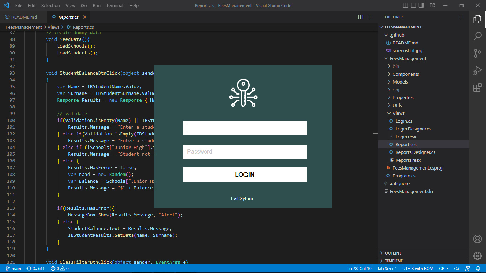

# Fees Management



**DISCLAIMER:** This is Work In Progess, functionality and features may be broken or still under development.

## About App

Simple login and reports generation for a single student, an entire class or the entire school when requested.

## Getting Started

To get started, add a list of students manually in the Reports.cs code (found in Views folder) in the `LoadStudents()` function. From there, you can add the student details as well as their fees arreas.

## Login Accounts

Logins have been hardcoded into the `Config.cs` file. You can use the following accounts to login.

Username|Password
--|--
block2023|2023

## Students Accounts

By default there are two predefined student accounts as in the `Reports.cs`

Name | Surname | Balance
--|--|--
John|Doe|200
Mary|Doe|<kbd>random</kbd>

## Folder Structure

The projects contains two types of folders &ndash; GitHub and System folders.

### Github Files

Folder | Description
---|---
.github | Contains github configuration files (including this **README.md** file) and is safe to delete.

### System Files

These are the files in the FeesManagement directory

Folder | Description
---|---
Components | Contains all the custom designs
Properties | Automatically created with SharpDevelop
Utils | Contains custom utility functions that help with validation
Views | This is where all views are kept

## How it works

The system does not make use of an SQL Database but rather stores it's data temporarily in memory using **Lists** and **Dictionaries**. 

Lists can be described as 1D Arrays of one type while Dictionaries are Objects that map data using a unique.

These data types have been initialized in the **Reports** form under Views and they look something like this:

```cs
/**
*********************************
* file: Reports.cs
*********************************
* School is a class
* defined in the Models folder 
*/

/** initialize : this is like the database **/
public Dictionary<string,School> Schools = new Dictionary<string,School>();

/** create a new school **/
CreateSchool("School Name");

/** add a new student **/
AddStudent("Mary","Doe",1,"Junior High");
AddStudent("John","Doe",1,"Junior High",200);
```

Custom functionality for searching students has been written in the (Schools) models file(s) in a less confusing way though it can be refactored.

## Issues &amp; Impovements

Since the data is stored in memory, it is resetted every time the application is restarted. To fix this, we need to use a persistent database.

## Icons Used

All icons in this project were downloaded from [icons8](//Icons8.com)
